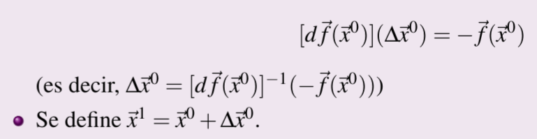

# Sistemas no lineales
# Método de punto fijo

### Problema 3.16
"Dejar ese sistema como si fuese un sistema homogéneo."

## Procedimiento
Procedimiento de método de punto fijo.

### Problema 3.17

## Teorema de Convergencia Local

# Método de Newton

Los test de convergencia se aplican sobre la diferencia.

### Problema 3.19

## Teorema de convergencia local
df(r→) debe de ser invertible, f(x,y) debe de ser de clase 2 y debe de tener una raíz.

## Variaciones sobre el método de Newton
Solo es relevante la extensión del método de la secante.

### Problema 3.21

Computación Numérica (CEX)

Date & Time:Fri, Mar 4, 2022, 3:00 PM - 5:00 PM
Location:AS-1
Antonio Palacio Muñiz Clase Expositiva

Computación Numérica (CEX)

Date & Time:Mon, Mar 7, 2022, 5:00 PM - 6:00 PM
Location:AS-1
Antonio Palacio Muñiz Clase Expositiva
