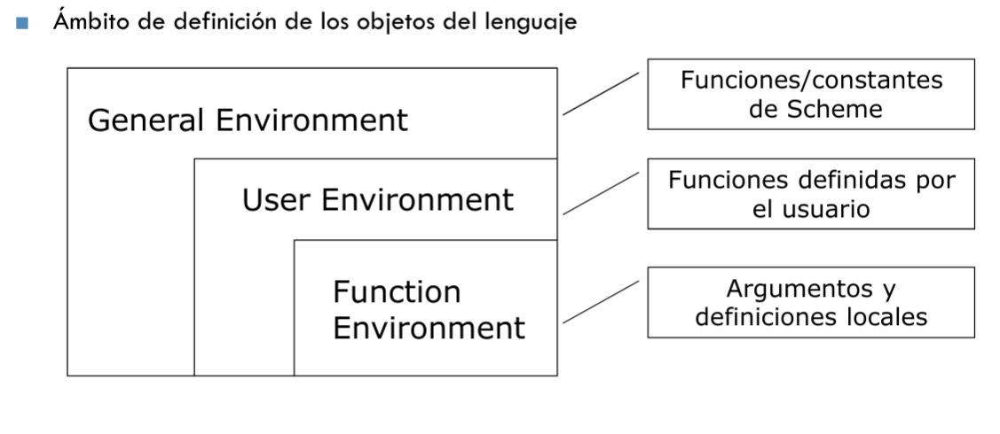

# Funciones de Orden Superior
### Definición
Una función se dice de orden superior si:

* alguno de sus argumentos es una función.
* si devuelve una función.
* si devuelve una estructura que contiene una función.


### Ventajas
* ✓ Programas más concisos sin perder generalidad.
* ✓ Programas genéricos, funciones parametrizadas por medio de otras funciones.
* ✓ Alto nivel de reutilización.
* ✓ Generación automática de código.


```scheme
; genera-iva :: Real → (Real → Real)
(define (genera-iva tipo)
    (lambda(base) (* base (+ 1 (tipo)))))

(define iva-reducido (genera-iva .1))
(define iva-normal (genera-iva .21))

;;; Resultados
> (iva-normal 100)
121.0
> (iva-reducido 1000)
1100.0
```


# F.O.S. definidas sobre listas

## Filter
Filtra elementos no deseados de una lista.
`(filter <función-test> <list>)`

```
> (filter positive? '(-3 4 6 -2 9 -11))
(4 6 9)
> (filter (lambda(e) (and (positive? e) (even? e))) '(-3 4 6 -2 9 -11))
(4 6)
```


## Take-while
Devuelve el prefijo de una lista.
>[!WARNING]
>Requiere `srfi/1`.

`(take-while <función-test> <list>)`
```
> (take-while positive? '(1 2 -3 4 5))
(1 2)
```


## Drop-while
Devuelve el sufijo de una lista.
>[!WARNING]
>Requiere `srfi/1`.

`(drop-while <función-test> <list>)`
```
> (drop-while symbol? '(Ana Gutiérrez Espina 24 M 5.6 1239 Algoritmia))
(24 M 5.6 1239 Algoritmia)
```


## Apply

Aplica una función a una lista de argumentos.
`(apply <función> <list>)`

```
> (apply max '(1 2 3 4 99))
99
```


## Map

Aplica una función de aridad _n_ a los i-ésimos elementos de n-listas.
`(map <función> <list1> <list2> ... <listn>) ⇒ <list>` 

```
> (map car '((a b) (c d) (e f))
(a c e)
> (map + '(1 2) '(4 5))
(5 7)
> (map (lambda(x) (+ x 2)) '(1 2 3 4))
(3 4 5 6)
```

##

## Compose

`((compose <funcA> <funcB> ... <funcN>) <x> ... <y>) ⇒ <resultado>`

```
> ((compose car cdr cdr) '(a b c d e))
c
> (caddr '(a b c d e))
c


```


## Tras

Traspone una matriz en forma de lista de listas.
`(tras <matriz>) ⇒ <matriz-traspuesta>`

```
;; Matriz -> Matriz
(define (tras Matriz)
    (apply map list Matriz))

> (tras '((1 2) (3 4) (5 6)))
((1 3 5) (2 4 6))
```

##

## Fold(l/r)

Pliegue de los elementos a un solo valor.
`foldl <funcion(elem,Res)> ini <list>)`


# Alternativa de sintaxis para func. lambda

`(lambda <lista-args> <función-lista>)`

Para especificar un número mínimo de argumentos:
`(lambda (<arg1> <arg2> ... <argn> . <Largs>) <func-λ>)`
donde _n_ es el número mínimo de argumentos.

Ejemplos:
```
> (define promedio (lambda x (/ (apply + x) (length x))))
> (define promedio-min (lambda (a . L) (/ (apply + a L) (+ 1 (length L))))

; promedio no tendrá número mínimo de arugmentos, por lo que si no se introduce ninguno, realizará una división entre cero.
; promedio-min tiene número mínimo de arguemntos 1, por lo que nunca va a dividir entre cero.
> (promedio)
. . /: division by zero
> (promedio-min)
. . promedio-min: arity mismatch;
the expected number of arguments does not match the given number
  expected: at least 1
  given: 0

; ambas funciones realizan realmente la misma operación.
> (apply promedio '(16 18 20))
18
> (apply promedio-min '(16 18 20))
18
```


# Definiciones locales

## Let(*) y Letrec




### Let

Perimte asociar una definición a un conjunto de símbolos, limitando su ámbito a dicha expresión.
`(let ( ( id1 val1) (id2 val2) .... (idn valn) ) body)`

```
> (define (suma x y)
    (let ( (resultado (+ x y)) )
        (list x '+ y '= resultado)))
> (suma 5 4)
(5 + 4 = 9)
```


### Let*

Funcionamiento igual a `Let` , pero permite definiciones de manera secuencial.


### Letrec

Funcionamiento igual a `Let*` , pero permite utilizarlas recursivamente.

[Tecnologías y Paradigmas de la Programación (CEX)](https://www.google.com/calendar/event?eid=XzhkOWxjZ3JmZHByNmFzams3NWozZ2NocDZvcTNhZTlsNzBzM2dvcjZjZGgzZ2Noa2M4b2pjZHIyNzByajJwajVjcGgwIHVuZGVyc2NvcmViaXNAbQ)

Date & Time:Tue, Feb 8, 2022, 2:00 PM - 4:00 PM
Location:AS-1
Clase Expositiva

[Tecnologías y Paradigmas de la Programación (CEX)](https://www.google.com/calendar/event?eid=NWlvdGpqc2Zua2hnY2duZm41ZjhuNGpsaDIgdW5kZXJzY29yZWJpc0Bt)

Date & Time:Fri, Feb 11, 2022, 5:00 PM - 6:00 PM
Location:AS-1
Clase Expositiva

[Tecnologías y Paradigmas de la Programación (CEX)](https://www.google.com/calendar/event?eid=XzhkOWxjZ3JmZHByNmFzams3NWltYXBiNjZvcW04ZGoyNjBvbTZkYjZjcGhqY2M5aWM0c2o0cGozY2xpamNvajNjOWkwIHVuZGVyc2NvcmViaXNAbQ)

Date & Time:Mon, Feb 14, 2022, 4:00 PM - 5:00 PM
Location:AS-1
Clase Expositiva
