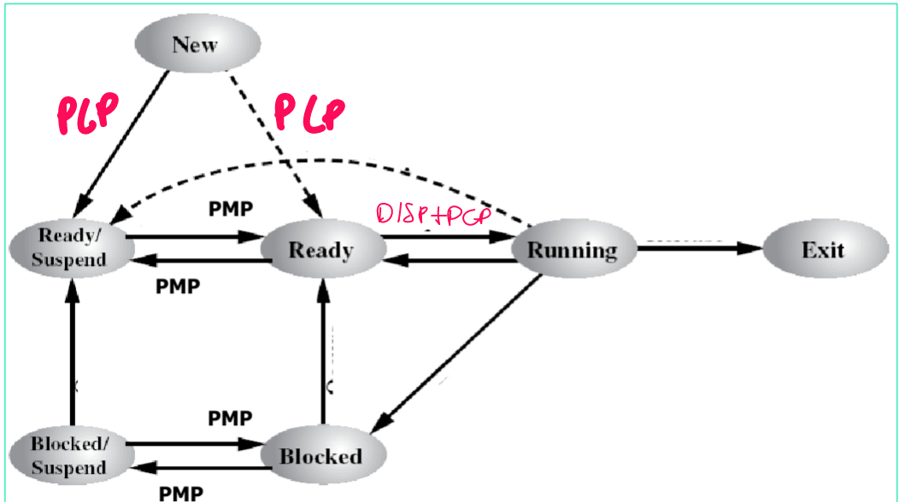

# Control de procesos
* **PLP**: planificador a largo plazo.
* **PMP**: planificador a medio plazo.
* **PCP**: planificador a corto plazo.

### ¿Qué significan?

Hace referencia al impacto en el tiempo de la decisión que toma cada planificador.
Cuanto a mayor plazo sea el impacto, más fácil de implementar y menos frecuencia de invocación tendrá.
El PCP es el planificador más crítico, que más veces se ejecuta, y que mayor impacto tiene en el rendimiento.

# Tipología de los procesos

* Intensivo en CPU
* Intensivo en E/S

# Planificadores

## Planificador a largo plazo

Es el planificador que admite procesos desde el estado "nuevo", es decir, toma decisiones de creación de procesos.

### Grado de multiprogramación

Es el número de procesos que están cargados en memoria principal.

Cuanto más grado de multiprogramación, mejor funciona la multiprogramación y menos espacio hay en memoria.
El PLP puede mantener o hacer crecer el grado de multiprogramación.

_¿Qué módulo del sistema operativo se encarga de la transición de "Nuevo" a "Listo"?_
_¿Quién se encarga de la creación del código, de datos de un programa y de cargarlos a mem. principal?_

* El planificador a largo plazo.

## Planificador a medio plazo

Es el planificador que se encarga de suspender y restaurar procesos.

Regula el grado de multiplicación: puede mantenerlo, subirlo o bajarlo.

## Planificador a corto plazo

Asigna la CPU a un proceso en estado "listo". Este planificador devuelve el PID de dicho proceso.

Está relacionado con la transición de "Listo" a "En ejecución", pero el planificador NO REALIZA LA TRANSICIÓN, simplemente devuelve un entero que define qué proceso se va a transicionar.

No afecta al grado de multiprogramación.

_¿Puede el planificador a corto plazo devolver un PID no válido?_

* Sí, por ejemplo si no existen procesos en estado "Listo".

## Despachador

* Salva y restaura procesos.
* Pone en ejecución a los procesos que decide el PCP.
* Realiza el resto de acciones del grafo triviales.

# Algoritmos de planficación a corto plazo

No puede ocurrir empates.

[Sistemas Operativos (CEX)](https://www.google.com/calendar/event?eid=XzhkOWxjZ3JmZHByNmFzams3NWkzaWUxazZsaW0yY2oyNjFnamVjcG82a3A2YWQxbmM0czNlb2htNmhpajBkcGhjb3FnIHVuZGVyc2NvcmViaXNAbQ)

Date & Time:Mon, Feb 21, 2022, 2:00 PM - 4:00 PM
Location:AS-1
Clase Expositiva
