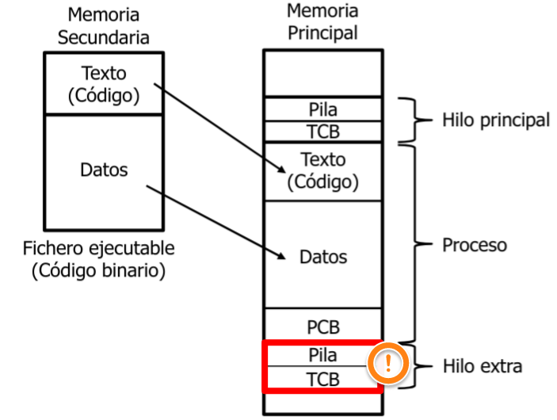

# Hilos
El hilo de un proceso son los que ejecutan código. **Los procesos no ejecutan código.**
Los procesos se componen de al menos un hilo. Los hilos solo ejecutan código y sus recursos son los que tenga el proceso.

## Composición en memoria

Los procesos tendrán:

* Al menos un hilo, llamado _hilo principal._ Este hilo se comienza a ejecutar desde el main del programa.
* Su imagen cargada en memoria principal.

Los procesos NO ejecutan código:

* No se les asigna la CPU → no se les planifica.
* Carecen de estados ("Listo", "Suspendido", etc)
* Carecen de pila
* Tienen PCB pero sin información de estado y de control.

Los hilos ejecutan código, cada hilo tendrá:

* Una pila de ejecución.
* Un mini PCB (llamado **_TCB_** → Thread Control Block) con:
  * Estado del hilo
  * Contexto de ejecución del hilo
* Acceso a la memoria y recursos de su proceso, compartido con el resto de hilos del mismo.

* * *

## Creación de procesos e hilos

EL SO (PLP) carga el programa y crea el proceso con UN hilo, el hilo principal.

El programador es responsable de crear más hilos de ejecución con una llamada al sistema, ejecutada por el hilo principal.

* ✅  Crear un hilo es muy rápido y eficiente.
* ~ Acceso a la memoria y recursos de su proceso, compartido con el resto de hilos del mismo.
* ❌ Ejecutan el mismo programa
  * **Solución:** al crear un hilo se le asocia una función del prorgrama.

## Gestión de procesos e hilos

El SO gestiona y controla el proceso y todos sus hilos.

* Son los hilos los que tienen estados y no los procesos.
* Son los hilos los que trasncurren por el ciclo de vida.
* Se asigna la CPU a un hilo, no a un proceso.
* Se salva y restaura el contexto de los hilos, no de los procesos.
* Se suspenden y restauran procesos (PMP) → TODOS sus procesos.

## Finalización de procesos e hilos

Un hilo finaliza de manera independiente al resto de hilos del proceso (incluso cuando ocurren excepciones).

El proceso finaliza cuando:

* Finalizan todos sus hilos.
* En algunas implementaciones, cuando finaliza su hilo principal se finalizan automáticamente el resto de hilos.

* * *

## Beneficios de los hilos

* Es menos costoso crear un hilo en un proceso existenten que crear un proceso nuevo.
* Es menos costoso finalizar un hilo que un proceso.
* Es menos costoso hacer un cambio de hilo en un proceso que hacer un cambio de proceso.
* Los hilos del mismo proceso se comunican entre ellos compartiendo memoria. (!)

## Ejemplos de uso

* Trabajo en primer plano y segundo plano.
  * Un hilo dedicado a la interfaz con el usuario.
  * Otro hilo ejecuta los mandatos del usuario.
* Procesamiento asíncrono de eventos.
  * Un hilo en un procesador de textos que saca copia de seguridad periódica → atender temporizador.
* Velocidad de ejecución
  * Sacar partido de un sistema con varias CPUs y/o núcleos de CPU
* **Servicios de red**
  * Cada hilo atiende a un cliente (conexión) distinto.
  *

[Sistemas Operativos (CEX)](https://www.google.com/calendar/event?eid=XzhkOWxjZ3JmZHByNmFzams3NWdtOGM5bzY0czY2cGI0NmxpNmFkaG5jZ3A2MmRobjZrcm1jcDlnNjhvNjJwajM3MWgwIHVuZGVyc2NvcmViaXNAbQ)

Date & Time:Tue, Feb 22, 2022, 4:00 PM - 5:00 PM
Location:AS-1
Clase Expositiva
