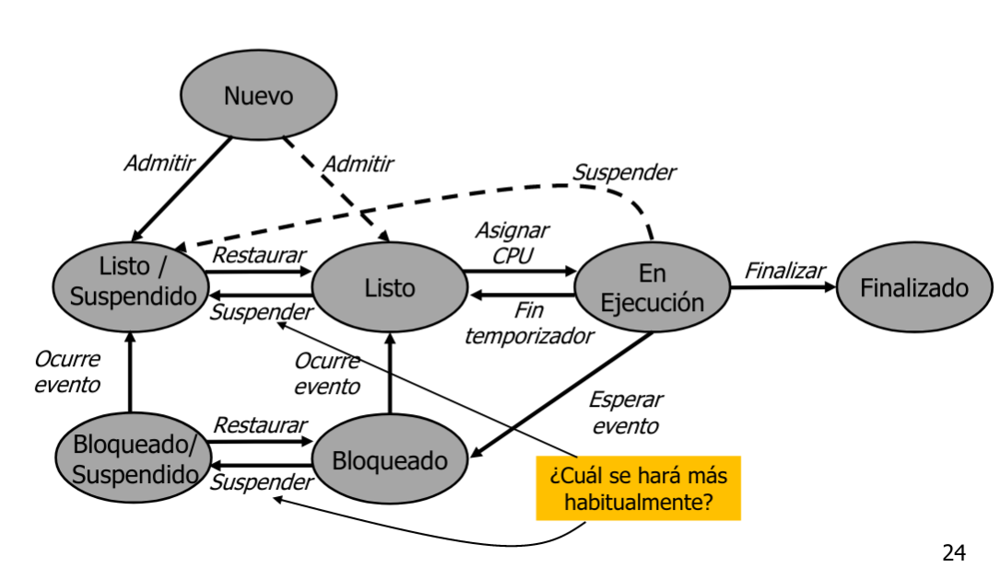

# Procesos
# Definición de proceso

Un proceso es una instancia de un progarma en ejecución.

Un programa es estático. Un proceso es dinámico.
Un programa está siempre en memoria secundaria. Un proceso está, de manera natural, en memoria principal, aunque también puede estar en disco.
Un proceso tiene asignado un código, una pila, un PCB y, en algunas ocasiones, un área de datos.

# Imagen del proceso

Está cargado en memoria principal:

* Código, datos y pila
* Contexto de ejecución del proceso (**PCB**): es información que el SO/CPU necesitan para administrar el proceso.

## Creación

1. **Carga de un programa**

Operación que crea parte de la imagen del proceso copiando información almacenada en un fichero ejecutable desde mem. secundaria. Dicho fichero debe de estar compilado, no interpretado. Se carga el código y datos del programa original y se crea la pila y la PCB en RAM.

2. **Mediante clonación**

Copia de otro proceso ya existente (sin cargar ningún programa). Al copiar, hay que alterar la PCB.

# Descripción de procesos

## Estructuras de control de SO

EL SO necesita poder acceder a la información de TODOS los procesos en cualquier momento, lo más rápido posible:

**Tabla de preocesos del sistema: almacena el PCB de TODOS los procesos.**

Puede ser un vector indexado por el PID del proceso. Suele apuntar al PCB, en vez de contenerlo.
Reside siempre en memoria principal, al igual que los PCB.

## Bloque de control de procesos (**_P_**_rocess_ **_C_**_ontrol_ **_B_**_lock_)

Estructura de datos que contiene información diversa y necesaria para que el SO gestione y controle UN proceso.

Un proceso puede existir antes y después de que su programa esté en ejecución.
Un proceso existe mientras tiene un PCB.

* Cada SO le da una implementación diferente.
* Todas las operaciones que el SO realiza sobre un proceso implican la manipulación de su PCB.
* Todos están en la tabla de procesos.

###

### Elementos básicos de un PCB

1. **Identificación del proceso**
  * Identificador númerico único de proceso (PID)
  * Identificador de su proceso padre (PPID)
    * ⚠️  Solo existe en SO que organicen los procesos en jerarquía de árbol.
2. **Información de estado del procesador**
  * Contenido de los registros del procesador ya salvados en la pila, se copian al PCB.
  * A esta operación se le llama _salvar contexto_. A la operación contraria se le llama _restaurar contexto_.
  * ¿Cuántos PCB se acceden como mínimo y como máximo?
    * Como mínimo a uno y como máximo a dos.
  * Permite que el intercalado de instrucciones funcione correctamente (**_Multiprogramación y tiempo compartido_**)
3. **Información de control del proceso**
  * Toda la información adicional necesaria para que el SO controle y coordine los procesos activos.
    * Información de planificación y **estado del proceso**.
      * Prioridad, estado, información de planificación.
      * Estados:
        * En ejecución
        * E/S
        * Listo
    * Pertenencia del proceso a estructuras de datos.
    * **Ubicación en memoria**
    * Comunicación entre procesos
    * Privilegios del proceso
    * Uso y propiedad de recursos
4. **Estructuras de datos**
  * Una estructura de datos por cada estado de proceso.
  * En cada estructura de datos se almacena el PID de cada proceso en eso estado.
  * Además, en algunas estructuras se almacenan otros datos:
    * Para los procesos bloqueados, se almancena el evento por el que está esperando.

# Ciclo de vida de los procesos

## Modelo sencillo

En todo momento, un proceso está ejecutándose en el procesador o no.
Solo ocurre en sistemas con monitor.

## Modelo de cinco estados

Se divide el estado "no ejecución" en dos:

* **Listo:** el proceso está preparado para ejecutarse en el momento que se le dé la oportunidad. Está en memoria principal.
* **Bloqueado:** el proceso no puede ejecutarse hasta que ocurra algún evento (sigue en E/S)

Además, se añaden dos nuevos estados:

* **Nuevo:** estado en el que está un proceso cuando se crea su PCB, puede o no estar en memoria.
* **Finalizado:** estado al que transiciona un proceso cuando se ejecuta _exit_ u ocurre una excepción.
  * En UNIX, el proceso se mantiene en estado finalizado hasta que su proceso padre recoge la información.

### En multiprogramación

No existe la transición entre ejecución y listo porque al proceso agota la ráfaga de CPU de cada proceso SIEMPRE, aunque ocurran interrupciones de por medio. El SO siempre le devuelve el control al mismo proceso.

### En tiempo compartido

## Modelo de siete estados

Si el sistema operativo se queda sin memoria o si así lo indica, se pueden salvar procesos bloqueados o poco prioritarios a memoria secundaria y se descargan de memoria principal, es decir, **_se suspende el proceso_**. En memoria principal se conserva únicamente el PCB.
Esto requiere un estado nuevo.

Los proceos más idóneos para suspender son los que están en estado bloqueado, porque se ahorra memoria principal en procesos que no requieren usar la CPU en un tiempo comparativamente largo.

[Sistemas Operativos (CEX)](https://www.google.com/calendar/event?eid=XzhkOWxjZ3JmZHByNmFzams2bGozOGNiNjZvcjM2Y2hpNnRpbTJvajNjY3M2NnBobGM4c21hbzlwNmdwamdlMzU2ZGhnIHVuZGVyc2NvcmViaXNAbQ)

Date & Time:Tue, Feb 15, 2022, 4:00 PM - 5:00 PM
Location:AS-1
Clase Expositiva

[Sistemas Operativos (CEX)](https://www.google.com/calendar/event?eid=XzhkOWxjZ3JmZHByNmFzamtjY29qYXBobTZwaDNhY3I0NjFoamNlOWtjbGo2YXA5ZzZ0aDMwYzFuYzRvamlvcGw2NWkwIHVuZGVyc2NvcmViaXNAbQ)

Date & Time:Fri, Feb 18, 2022, 2:00 PM - 3:00 PM
Location:AS-1
Clase Expositiva

[Sistemas Operativos (CEX)](https://www.google.com/calendar/event?eid=XzhkOWxjZ3JmZHByNmFzams3NWkzaWUxazZsaW0yY2oyNjFnamVjcG82a3A2YWQxbmM0czNlb2htNmhpajBkcGhjb3FnIHVuZGVyc2NvcmViaXNAbQ)

Date & Time:Mon, Feb 21, 2022, 2:00 PM - 4:00 PM
Location:AS-1
Clase Expositiva
