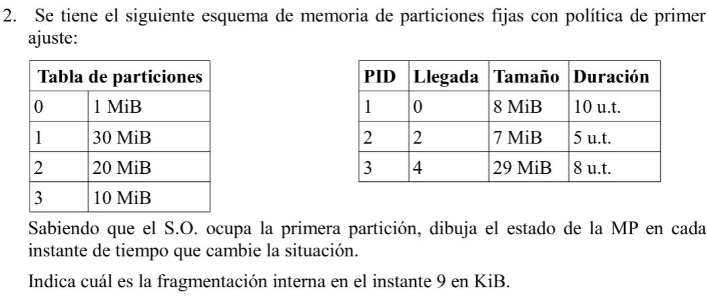
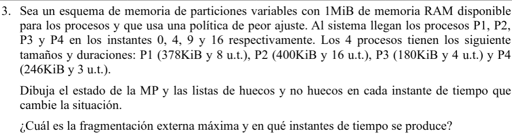
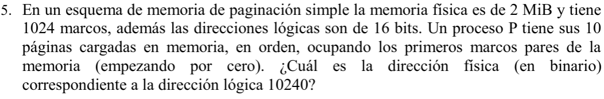
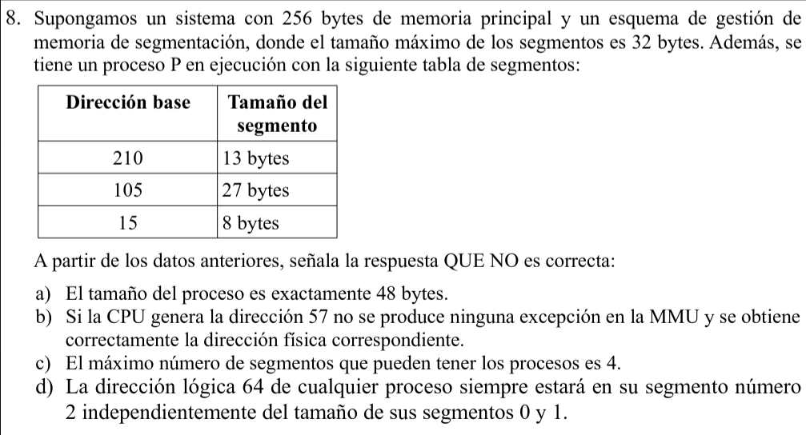
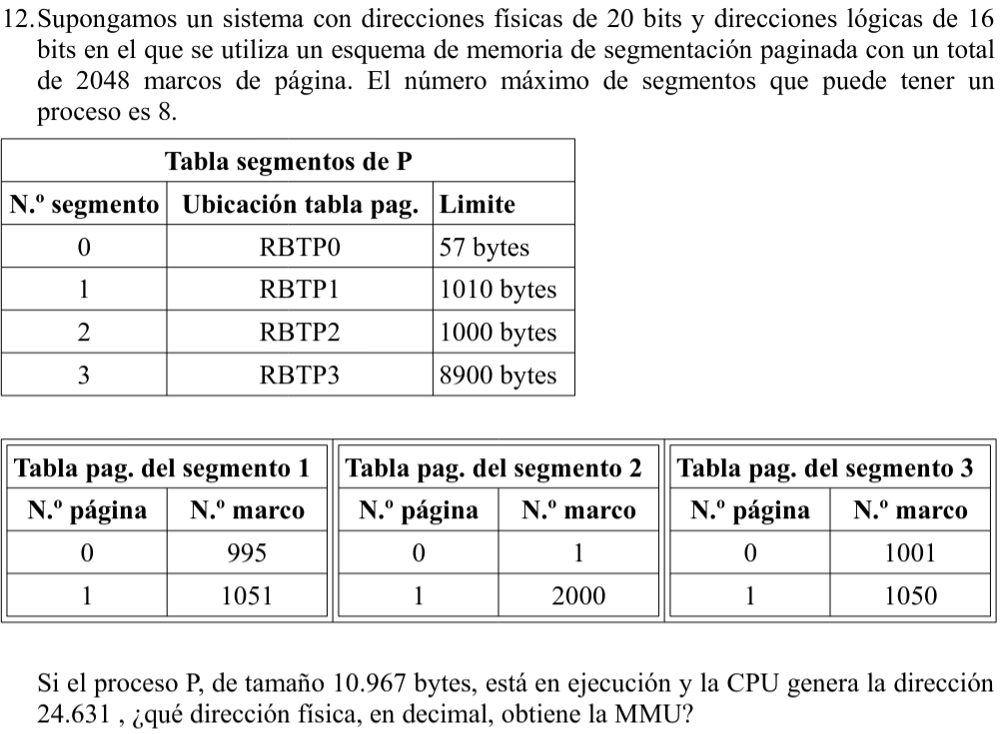
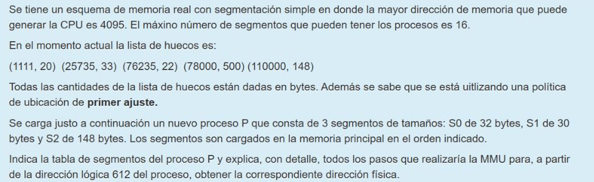
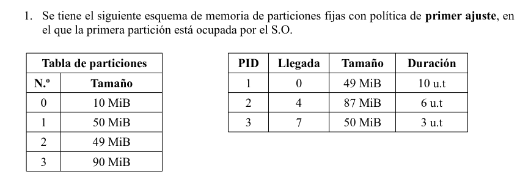

# Ejercicios de particionamiento de memoria real

Va a haber ejercicios de:

* Part. fijas
* Part. variables [**↑ INDICAR SITUACIÓN MP EN CADA UT ↑**]
* Paginación [**↓ PROTECCIÓN + TRADUCCIÓN ↓**]
* Segmentación
* Segmentación paginada

Datos en cada ejercicio:

* **Por proceso:**
  * PID
  * Instante de llegada
  * Tiempo de retorno
  * Tamaño
* **En cada ejercicio:**
  * Tamaño RAM
  * Tamaño SO
  * Tiempo inicial (t=0)
* Incluyendo la información necesaria del esquema elegido.

Si en el enunciado se tiene L o R exclusivamente, se entiende que son ambos iguales.

* * *

### Ejercicio 2, particiones fijas.

**Información obtenida:** tamaño SO = 1MB, tamaño RAM = 61MB, t = 0.

### Ejercicio 3, particiones variables.

**Información obtenida:** no hay SO, 1MiB → 1024KiB mem. principal, t=0.

### Ejercicio 5, paginación.

### Ejercicio 8, segmentación.

### Ejercicio 12, segmentación paginada.

### Ejercicio random2.

### Ejercicio 1, corrupción A.

### Ejercicio 2, corrupción A.

